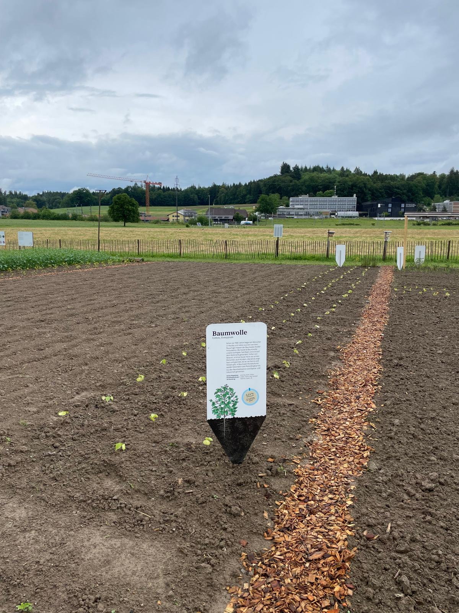
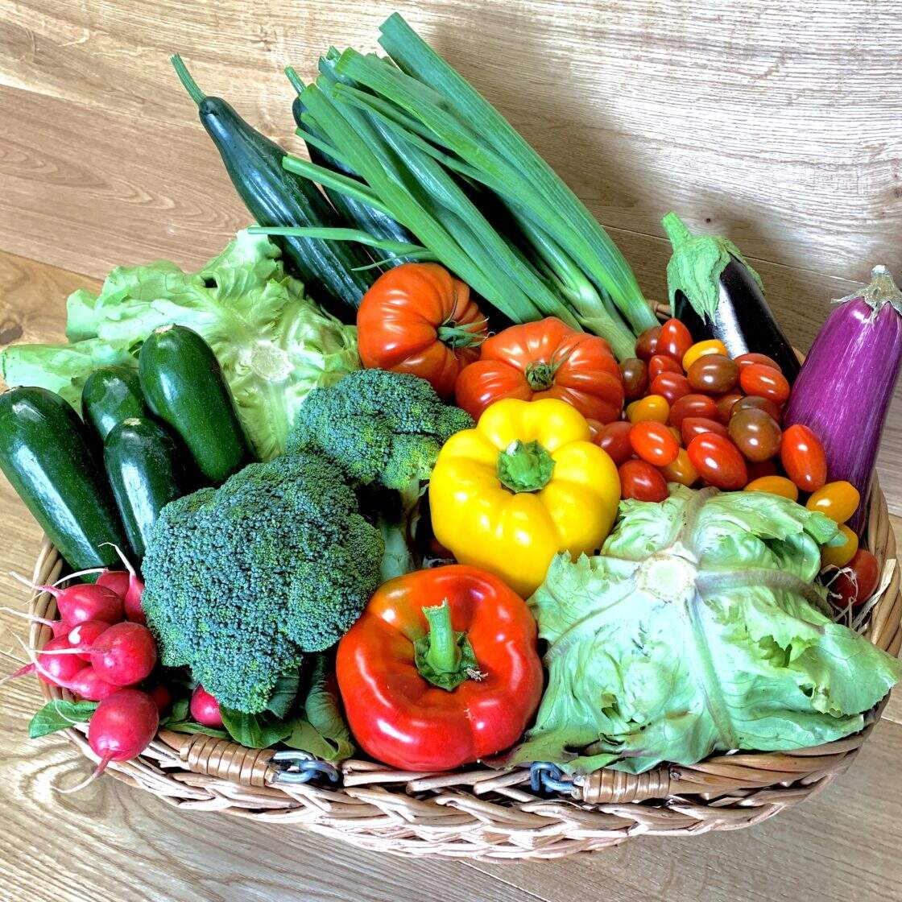

+++
title = "Die Nachhaltigkeit der Landwirtschaft"
date = "2024-06-18"
draft = false
pinned = false
+++


Der Boden wird unfruchtbar, während der Mensch weiterkonsumiert – die Angehensweisen sind gespalten.  



## Der Weg zum Grenzfall 

Die Zeit läuft der Bodenfruchtbarkeit davon. Der Boden hat keine Zeit zur Regeneration, wird von Monokulturen belastet und die Erde leidet an Mineralienmangel. 1850 begann die Schweizer Bevölkerung drastisch zu steigen. Während sich die Industrialisierung entwickelte, nahm die Anzahl Landwirtinnen stetig ab. Durch den zunehmenden Import verringerte sich die zur Agrarkultur verwendete Fläche. Im Jahr 1850 nahm der Getreideimport in der Schweiz deutlich zu. Dies hatte zur Folge, dass der Ackerbau, durch die günstigeren Importpreise, in den Alpen unrentabel wurde. Infolgedessen mussten viele Bauerinnen ihren traditionellen Getreideanbau aufgeben. Stattdessen verbreitete sich die Milchproduktproduktion. Dadurch wird die Schweiz als Milch- und Käseland geprägt. Dies zeigt sich in den traditionellen Schweizer Gerichten, Fondue und Raclette. Zur Gewinnmaximierung beginnen Landwirt*innen, ihre Tiere ganzjährig einzustallen. In den 1870er Jahren werden die ersten Pestizide eingesetzt. Die traditionelle Landwirtschaft erlebt einen Niedergang, und es kommt zu einer grossen Abwanderungsbewegung, was zum ersten Landwirtschaftsgesetz führt. 

Nach dem Ersten Weltkrieg brach eine markante Ernährungskrise aus. Im Jahr 1918 wurde eine Vereinigung gegründet, um die obligatorische Nahrungsmittelproduktion auszuweiten und die Menschen vor Hunger zu bewahren. In der Zwischenkriegszeit erlebte die Schweiz eine bedeutende Ausbreitung der landwirtschaftlichen Flächen. Diese sicherte der Schweiz eine Selbstversorgung und Sicherheit. In Bern dominieren die grösseren und mittleren Betriebe und die Bedeutung der Bodenverbesserung nimmt zu. Während des Zweiten Weltkriegs werden die Bauern idolisiert, doch viele werden zum Militärdienst eingezogen. Trotz verschlechterter Bedingungen steigt die Produktion dank Ertrags- und Produktivitätssteigerungen. Diese steigt so weit, dass die Produktionsaktivität mit dem Bevölkerungswachstum mithalten kann. Die Selbstversorgung baut sich aus. Die Nachkriegszeit war geprägt von einem raschen Strukturwandel und einer enormen Steigerung der Erträge. Eine neue Agrarrevolution beruhte auf Zuchterfolgen, Motorisierung und dem Einsatz von Kunstdünger und Pflanzenschutzmitteln. In den 1990er Jahren setzte eine Umorientierung hin zu stärkerer Marktorientierung und ökologischen Zielen ein. 

## Dein Stück Erde in Bern 

Mit nassen Füssen und tropfendem Haar schlenderten wir über die lange Landstrasse. Auf einem grossen Schild stand «Willkommen im INFORAMA». Links davon erstreckte sich der Weltacker, ein 2000 Quadratmeter grosses Feld. Dies entspricht der Ackerfläche, die jedem Menschen auf der Erde zur Verfügung steht. Rund um das Feld stand für jede Kultur ein Plakat. Diese erklärten einleuchtend die Auswirkungen der jeweiligen Kulturen auf die Umwelt. 

Auf der weltweit pro Person zur Verfügung stehenden Fläche werden auf dem Weltacker Bern in Zollikofen die 50 meistangebauten Kulturen anschaulich gezeigt. 

Martin Huggenberger zeigte uns die Baumwollfläche und erklärte, dass einer Person nur ein bis zwei Baumwoll-T-Shirts pro Jahr zur Verfügung stehen. Um die Schweiz unabhängig von Importen zu machen, würden jedem Menschen hierzulande 480 Quadratmeter zur Verfügung stehen – etwa ein Viertel der globalen Landfläche pro Kopf. Huggenberger betonte, dass eine unabhängige Schweiz möglich sei, dies aber eine Verringerung des Konsums von Tierprodukten erfordere. Nur so viel Tierisches könne konsumiert werden, wie Tiere gezüchtet werden können, ohne dass sie von den für Menschen bestimmten Ackerflächen gefüttert werden. Das bedeutet, dass Tiere vollständig von Grünflächen ernährt werden müssten. Zusätzlich müsse der Anteil an nährstoffreichen Kulturen wie Kartoffeln und Leguminosen erhöht werden. 

Aktuell werden in Mitteleuropa fast 3000 Quadratmeter pro Kopf genutzt. Dies entspricht beinahe einem halben Fussballfeld. Europa lebt somit auf ökologischem Kredit. 

 Dieser Ressourcenverbrauch mag zwar kurzfristig gewinnmaximierend wirken, ist jedoch mittel- und langfristig das Gegenteil von Nachhaltigkeit. 

## Die landwirtschaftliche Debatte 

In der Landwirtschaft müssen viele Aspekte verbessert werden, das ist allen klar. Doch wie das geschehen soll, darüber gehen die Meinungen auseinander. 

Ein Beispiel dafür ist Jason Steinmann, Präsident der Jungfreisinnigen Bern. Er betont in einem Interview zwei Schlüsselbegriffe: Wettbewerbsfähigkeit und freie Marktwirtschaft. Seiner Ansicht nach ist der Wettbewerb zwischen Landwirt\*innen in der freien Marktwirtschaft von großer Bedeutung, da dies zu besseren und günstigeren Produkten für die Kund\*innen führt. 

Als nächstes besuchten wir Chäspi Rentsch. Wir erkannten ihn sofort als wir ihn auf dem Schulgelände begegneten. Braune Locken, Regenstiefel und natürlich Latzhosen tragend, trafen wir ihn auf dem Bänkchen. Als wir ihn von der Meinung von Jason erzählten, wurde sein Blick strenger und er atmete tief ein. Er argumentierte, dass die Landwirtschaft gerade deshalb so schädlich geworden sei, weil sie wettbewerbsfähig sein musste. Landwirt*innen werden gezwungen, umweltfreundlich und biodiversitätsfördernd zu wirtschaften, da sie nur so staatliche Unterstützung erhalten. Diese Produkte müssen dann trotzdem auf den freien Markt gebracht werden und wettbewerbsfähig sein. Die Konkurrenz sind billige Importprodukte, die unter anderen Richtlinien produziert werden und somit günstiger sind. Chäspi meint, dass nachhaltige Produktion nicht möglich sei, solange billige Importe existieren. 

Jason Steinmann hingegen sieht den Import gleichwertiger Produkte als positiv. Er würde die Zölle senken und Subventionen reduzieren oder ganz streichen, um den Export zu fördern und die Landwirtschaft wettbewerbsfähiger zu machen. 

Doch es gibt noch andere Perspektiven. Martin und Linda vom Weltacker in Bern meinen, der „worst case“ sei nicht mehr weit, da die Wertschätzung für Landwirt\*innen verloren gegangen sei. Den Konsumierenden sei nicht mehr bewusst, dass die Landwirtschaft vom Wetter, von Maschinen und von großen Betrieben abhängig ist. Landwirt\*innen stünden so unter Druck, dass sie sich nicht mehr leisten können, Neues auszuprobieren. 

> Martin stellt klar: «Landwirtschaft braucht Wertschätzung – Sie wurde in den letzten Jahren zu einer Selbstverständlichkeit.» 

Abschließend betonte Linda, dass die Hälfte aller Nahrung noch nicht industriell produziert wird und dass kleine Bauernhöfe wertgeschätzt und unterstützt werden müssten. Unser wettbewerbs- und geldgesteuertes System unterstützt jedoch andere Tendenzen. 

Die Diskussion zeigt: Die Zukunft der Landwirtschaft wird heiss debattiert. Jede und jeder hat eine eigene Vision – doch welche sich durchsetzt, wird die Zeit zeigen. 

## Saisonal statt Pestizide 

Mittlerweile sind Bioprodukte über alle Verkaufskanäle erhältlich und ihr Marktanteil nimmt stetig zu. Bei nebligem Wetter begrüssen wir Chäspi Rentsch beim Eingang des Gymnasiums Kirchenfeld. Wir schütteln die Hand, tauschen uns aus und führen das Mitglied der Jungen Grünen in die Mediothek. Dort erzählt Chäspi vom Bauernhof seiner Eltern in Arni, Bern, wo er aufgewachsen ist. Solange sich der 24-Jährige erinnern kann, produzieren seine Eltern biologisch. Vor 24 Jahren übernahmen sie den Hof der Großeltern und liessen ihn als Biobauernhof zertifizieren. Auf Pestizide wurden schon einige Jahre zuvor verzichtet. Ohne Zertifizierung wird dies jedoch nicht anerkannt.  Viele Bauer\*innen stehen vor dem gleichen Problem, da sich nicht jede und jeder eine Bio-Zertifizierung leisten kann. Die Bauer\*innen können ihren kostenintensiven Preis ohne Zertifizierung nicht begründen, obwohl sie gleichen Aufwand erbringen wie biologisch zertifizierte Produzent*innen. 

Wenn Chäspi seine Lebensmittel besorgt, achtet er darauf, hauptsächlich Bioprodukte zu kaufen. Auch bei ihm kommt es jedoch manchmal vor, auf biologischen Einkauf zu verzichten. Was er aber am wichtigsten findet, ist saisonal einzukaufen. Der junge Mann kritisiert das Früchte- und Gemüsesortiment grosser Firmen, da diese seiner Meinung nach der Grund für die nicht saisonale Ernährung der Menschheit sind. Er glaubt, vielen sei nicht bewusst, welchen Einfluss der Kauf einer Tomate im Winter auf die Umwelt hat. Martin Huggenberger unterstreicht diese Ansicht. Er sagt: „Das Einfachste für den Menschen ist, dass es gar nicht im Angebot ist.“ 

Seit dem Bio-Boom in den 80er Jahren hat sich die Bioproduktion stark entwickelt. Es wurden strengere Richtlinien festgelegt und die Anzahl der Bioproduzenten wuchs. Heute ist die Bio-Produktion mehrheitsfähiger, doch Chäspi kritisiert, dass sich die Richtlinien mit der Zeit nicht verschärfen. Er meint, die Standards müssten sich kontinuierlich weiterentwickeln. Nur so könne die Menschheit eine nachhaltige Zukunft schaffen. 

## Der Schritt zum saisonalen Einkauf 

«Der Mensch ist zu faul für Nachhaltigkeit.», kritisiert Martin Huggenberger. In grossen Supermärkten kauft ein grosser Teil der Einkaufenden ein, ohne nachzudenken woher die Produkte kommen und wie sie produziert wurden. Der 60-Jährige sieht dies als Problem. Er wünscht sich Modelle von Produkten, welche durch ihr Gewicht den Einfluss der Früchte oder der Gemüse auf die Umwelt zeigen. Dabei müsste nur das Modell hochgehoben werden, um zu verstehen, wie umweltschädlich das Produkt ist. Das Ziel ist, auch erschöpft nach einem langen Tag, umweltbewusst einzukaufen. Sollten Einkaufende sich überlegen, Erdbeeren zu kaufen, wäre das Modell der Schweizer Demeter-Erdbeere deutlich leichter als jenes der Prix-Garantie-Erdbeeren aus dem Ausland. Huggenberger strebt nach dieser Idee und meint, dies sei die Lösung für umweltbewusstes Einkaufen. Ob das Bewusstsein einen Einfluss auf den Einkauf haben würde, liege in der Verantwortung der Einkaufenden, erklärt der Landwirt des Weltackers. 

<!--EndFragment-->